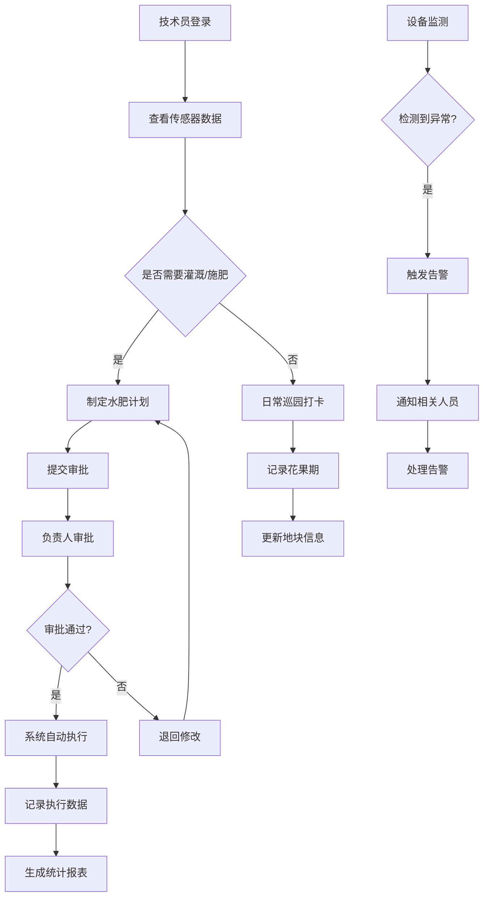

## 1. 产品概述

果园水肥一体化管理平台是面向规模化果园技术员和园区负责人的智能管理系统，整合物联网传感器、自动控制系统与数据分析能力，实现果园水肥资源的精准管理与智能决策。

- 核心价值：通过数字化手段提升果园管理效率，节约水肥资源，提高果品产量与品质
- 目标用户：规模化果园技术员、园区负责人、农业生产管理者

## 2. 核心功能

### 2.1 用户角色

| 角色 | 注册方式 | 核心权限 |
|------|----------|----------|
| 园区负责人 | 管理员创建 | 审批水肥计划、查看全部统计数据、管理地块与设备 |
| 果园技术员 | 管理员创建 | 制定水肥计划、远程控制阀门、查看传感器数据、巡园打卡、记录花果期 |

### 2.2 功能模块

1. **园区总览**：全局数据看板、气象信息、关键指标概览
2. **地块管理**：地块边界维护、土壤信息、作物信息、花果期记录
3. **传感器监测**：土壤水分数据、设备状态、管路状态、实时监测
4. **水肥计划**：灌溉计划制定、施肥配方管理、计划审批、任务调度
5. **执行记录**：灌溉执行记录、施肥执行记录、用水量统计、肥料用量记录
6. **告警管理**：设备离线告警、低水压告警、异常数据告警、告警处理
7. **统计分析**：成本统计、产量对比、水肥用量分析、趋势分析

### 2.3 页面详情

| 页面名称 | 模块名称 | 功能描述 |
|----------|----------|----------|
| 园区总览 | 数据看板 | 展示园区核心指标：总面积、地块数量、在线设备数、今日灌溉量、今日告警数 |
| 园区总览 | 气象数据 | 显示温度、湿度、风速、降雨量、光照强度等实时气象数据及未来预报 |
| 园区总览 | 地图概览 | 可视化展示园区地块分布、设备位置、实时状态 |
| 地块管理 | 地块列表 | 展示所有地块信息：名称、面积、作物类型、种植时间、土壤类型 |
| 地块管理 | 边界维护 | 支持在地图上绘制、编辑地块边界多边形 |
| 地块管理 | 花果期记录 | 记录花期、坐果期、成熟期等关键生长节点 |
| 地块管理 | 巡园打卡 | 技术员人工巡园打卡记录，支持拍照上传 |
| 传感器监测 | 设备列表 | 显示所有传感器及阀门设备的在线/离线状态、电量、信号强度 |
| 传感器监测 | 土壤监测 | 实时展示土壤水分、温度、EC值等数据曲线 |
| 传感器监测 | 管路状态 | 显示主管路、支管路的水压、流量状态 |
| 水肥计划 | 灌溉计划 | 新建、编辑灌溉计划：选择地块、设置时间、水量、阀门组 |
| 水肥计划 | 施肥配方 | 管理施肥配方：氮磷钾比例、微量元素配置、适用作物 |
| 水肥计划 | 远程控制 | 远程启动/暂停阀门，手动执行水肥任务 |
| 水肥计划 | 计划审批 | 园区负责人审批技术员提交的水肥计划 |
| 执行记录 | 灌溉记录 | 展示历史灌溉任务：时间、地块、水量、执行人、状态 |
| 执行记录 | 施肥记录 | 展示历史施肥任务：配方、用量、地块、时间 |
| 执行记录 | 用量统计 | 按时间段统计用水量、肥料用量 |
| 告警管理 | 告警列表 | 展示设备离线、低水压、数据异常等告警信息 |
| 告警管理 | 告警处理 | 标记告警处理状态、记录处理措施 |
| 统计分析 | 成本统计 | 按地块/时间段统计水肥成本、人工成本 |
| 统计分析 | 产量对比 | 多地块、多年度产量对比分析图表 |
| 统计分析 | 趋势分析 | 水肥用量趋势、产量趋势、土壤墒情趋势 |

## 3. 核心流程

## 4. 用户界面设计

### 4.1 设计风格

- **主色调**：森林绿 (#2D5A27) - 代表自然、农业、生机
- **辅助色**：土壤棕 (#8B6914) - 代表土地、丰收；天蓝 (#4A90D9) - 代表水源、科技
- **强调色**：橙色 (#E67E22) - 用于告警、重要操作；绿色 (#27AE60) - 用于成功、在线状态
- **背景色**：米白色 (#F8F5F0) - 营造自然、舒适的视觉感受
- **按钮风格**：圆角矩形，微立体效果，悬停时有轻微上浮动画
- **字体**：标题使用「思源宋体」体现农业自然感，正文使用「思源黑体」保证可读性
- **布局风格**：侧边导航 + 卡片式内容区，层级分明，信息密度适中
- **图标风格**：线性图标，结合农业元素（水滴、植物、土壤、传感器等）

### 4.2 页面设计概览

| 页面名称 | 模块名称 | UI 元素 |
|----------|----------|----------|
| 园区总览 | 数据看板 | 大数字卡片、渐变背景、图标动画、实时刷新 |
| 园区总览 | 地图概览 | 卫星地图底图、地块多边形填充、设备点位标记、状态色标 |
| 地块管理 | 地图编辑器 | 可拖拽多边形顶点、手绘模式、面积自动计算 |
| 传感器监测 | 数据曲线 | 平滑折线图、多轴对比、时间范围选择、阈值标线 |
| 水肥计划 | 计划表单 | 分步引导式表单、地块多选、日历时间选择器 |
| 告警管理 | 告警列表 | 状态色标签、告警等级图标、处理进度条 |
| 统计分析 | 数据图表 | 柱状图对比、折线趋势、饼图占比、数据钻取 |

### 4.3 响应式设计

- **桌面优先**：针对 1920px 及以上宽度优化，侧边导航固定宽度 240px
- **平板适配**：1024px-1920px，内容区自适应，保持侧边导航
- **移动适配**：1024px 以下，侧边导航转为底部 Tab 栏，图表简化为核心数据
- **触摸优化**：按钮最小点击区域 44x44px，列表项增加纵向间距

## 5. 非功能性需求

- **性能要求**：页面加载时间 < 3s，图表渲染 < 1s，实时数据刷新间隔 30s
- **数据安全**：用户权限隔离，操作日志完整记录，敏感数据加密存储
- **离线支持**：关键数据本地缓存，网络恢复后自动同步
- **可扩展性**：支持后续接入无人机巡园、AI 病虫害识别等功能模块
