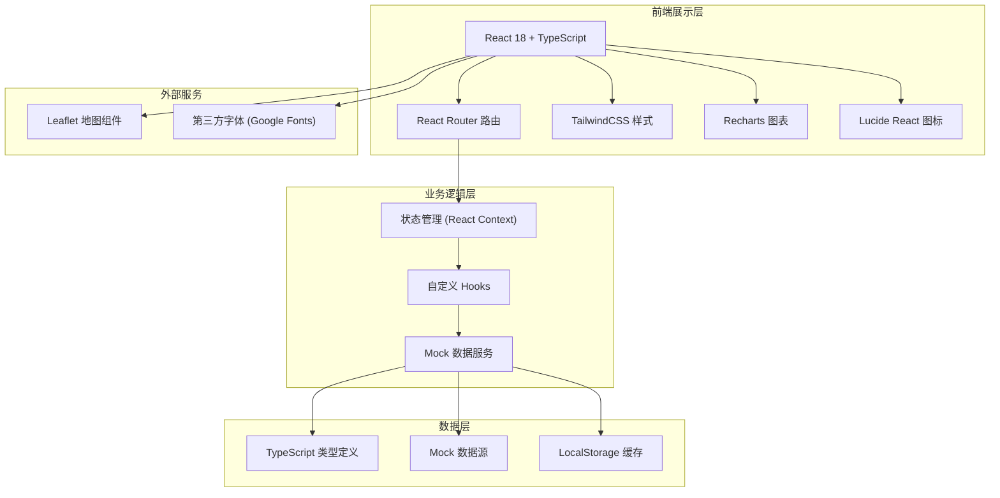
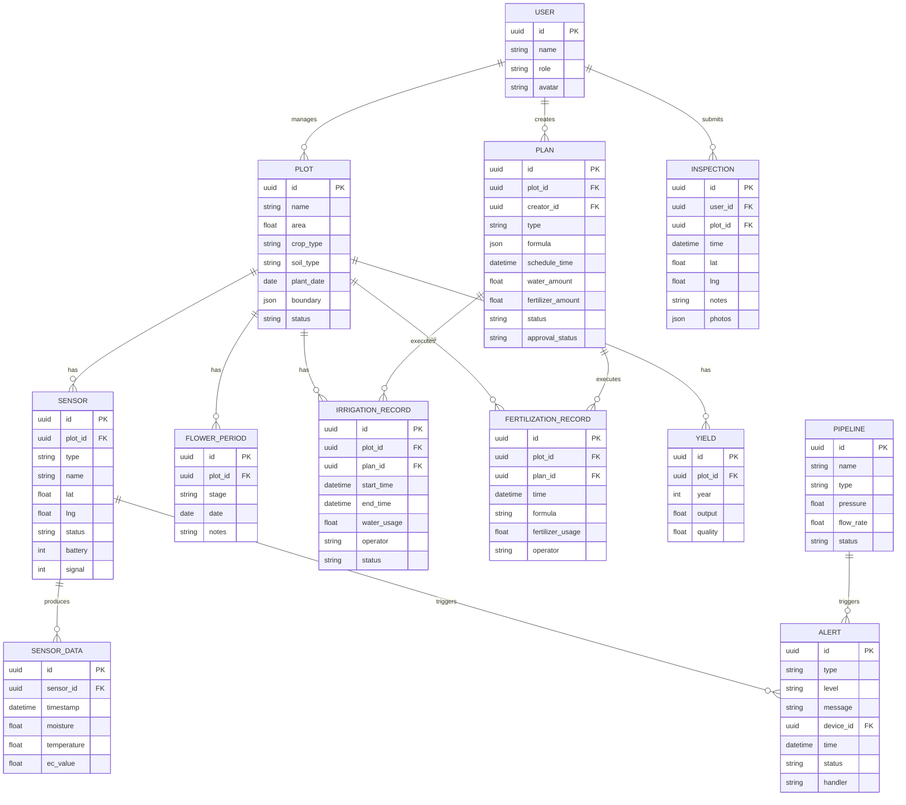

## 1. 架构设计



## 2. 技术选型

- **前端框架**：React 18 + TypeScript
- **构建工具**：Vite 5
- **样式方案**：TailwindCSS 3
- **路由管理**：React Router 6
- **图表库**：Recharts
- **图标库**：Lucide React
- **地图组件**：Leaflet + React-Leaflet
- **状态管理**：React Context + useReducer
- **数据模拟**：自定义 Mock 数据层
- **字体**：Google Fonts (Noto Serif SC, Noto Sans SC)

## 3. 目录结构

```
src/
├── assets/              # 静态资源
│   └── styles/          # 全局样式
├── components/          # 通用组件
│   ├── Layout/          # 布局组件
│   ├── Charts/          # 图表组件
│   ├── Map/             # 地图组件
│   ├── Table/           # 表格组件
│   ├── Form/            # 表单组件
│   └── UI/              # 基础 UI 组件
├── pages/               # 页面组件
│   ├── Dashboard/       # 园区总览
│   ├── Plots/           # 地块管理
│   ├── Sensors/         # 传感器监测
│   ├── Plans/           # 水肥计划
│   ├── Records/         # 执行记录
│   ├── Alerts/          # 告警管理
│   └── Statistics/      # 统计分析
├── context/             # 全局状态
├── hooks/               # 自定义 Hooks
├── services/            # 数据服务
│   ├── mock/            # Mock 数据
│   └── api.ts           # API 接口
├── types/               # TypeScript 类型定义
├── utils/               # 工具函数
├── router/              # 路由配置
├── App.tsx
└── main.tsx
```

## 4. 路由定义

| 路由路径 | 页面名称 | 说明 |
|----------|----------|------|
| `/` | 园区总览 | 默认首页，数据看板 + 气象 + 地图概览 |
| `/plots` | 地块管理 | 地块列表、边界维护、花果期记录、巡园打卡 |
| `/sensors` | 传感器监测 | 设备列表、土壤监测曲线、管路状态 |
| `/plans` | 水肥计划 | 灌溉计划、施肥配方、远程控制、审批 |
| `/records` | 执行记录 | 灌溉记录、施肥记录、用量统计 |
| `/alerts` | 告警管理 | 告警列表、告警处理 |
| `/statistics` | 统计分析 | 成本统计、产量对比、趋势分析 |

## 5. 数据模型

### 5.1 实体关系图



### 5.2 核心类型定义

```typescript
// 用户类型
interface User {
  id: string;
  name: string;
  role: 'manager' | 'technician';
  avatar: string;
}

// 地块类型
interface Plot {
  id: string;
  name: string;
  area: number;
  cropType: string;
  soilType: string;
  plantDate: string;
  boundary: Array<{ lat: number; lng: number }>;
  status: 'normal' | 'drought' | 'flooded' | 'diseased';
}

// 传感器类型
interface Sensor {
  id: string;
  plotId: string;
  type: 'soil_moisture' | 'temperature' | 'ec' | 'pressure' | 'flow';
  name: string;
  lat: number;
  lng: number;
  status: 'online' | 'offline' | 'low_battery' | 'low_signal';
  battery: number;
  signal: number;
  lastData: SensorData | null;
}

// 传感器数据
interface SensorData {
  timestamp: string;
  moisture?: number;
  temperature?: number;
  ecValue?: number;
  pressure?: number;
  flowRate?: number;
}

// 水肥计划
interface WaterFertilizerPlan {
  id: string;
  plotId: string;
  creatorId: string;
  type: 'irrigation' | 'fertilization' | 'both';
  formula?: {
    nitrogen: number;
    phosphorus: number;
    potassium: number;
    traceElements: Record<string, number>;
  };
  scheduleTime: string;
  waterAmount: number;
  fertilizerAmount: number;
  status: 'pending' | 'approved' | 'rejected' | 'executing' | 'completed' | 'paused';
  approvalStatus: 'pending' | 'approved' | 'rejected';
  createdAt: string;
}

// 告警类型
interface Alert {
  id: string;
  type: 'device_offline' | 'low_pressure' | 'low_moisture' | 'high_ec' | 'low_battery';
  level: 'info' | 'warning' | 'danger';
  message: string;
  deviceId: string;
  timestamp: string;
  status: 'unhandled' | 'processing' | 'resolved';
  handler?: string;
  handledAt?: string;
  handleNotes?: string;
}
```

## 6. 核心模块设计

### 6.1 地图模块
- 使用 Leaflet 实现交互式地图
- 支持地块多边形绘制与编辑
- 设备点位标记与状态可视化
- 地图缩放、平移、测距等交互

### 6.2 图表模块
- 土壤水分/温度/EC 值实时曲线图
- 水肥用量柱状图与趋势图
- 产量对比分析图表
- 成本占比饼图

### 6.3 实时数据模块
- 定时轮询刷新传感器数据（30秒间隔）
- WebSocket 模拟实时推送
- 数据本地缓存策略

### 6.4 权限控制
- 基于用户角色的路由守卫
- 操作按钮级别的权限控制
- 审批流程状态机管理

## 7. 性能优化策略

- 路由懒加载，按需加载页面组件
- 图表数据按需渲染，大数据量采用虚拟滚动
- 地图组件按需加载，瓦片地图缓存
- 防抖节流优化高频交互
- 组件使用 React.memo 避免不必要重渲染
